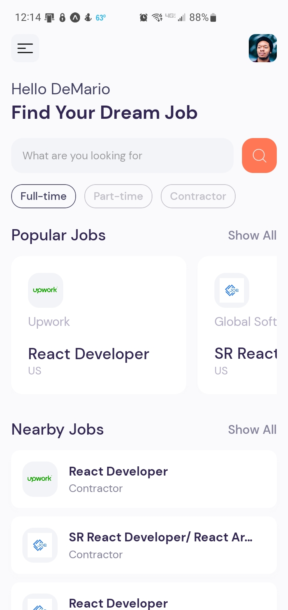
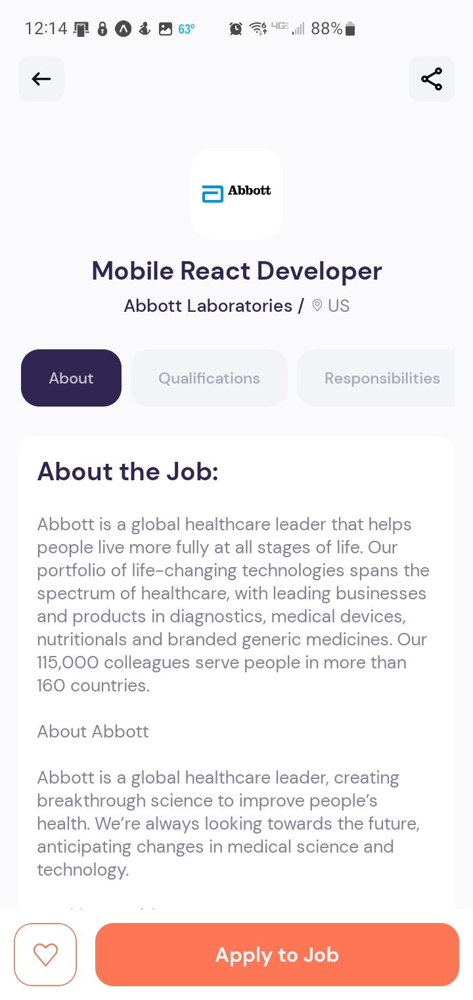

# Jobbidy - React Native Job Search App

## Overview

Jobbidy is a React Native job search app that allows users to search for job listings using the Jsearch API from RapidAPI.com. This app serves as a showcase of my React Native development skills and was developed with the guidance of JavaScript Mastery on YouTube.

  
  
  

## Features

- Search for job listings based on keywords, location, and other filters.
- View detailed information about each job listing.
- User-friendly and intuitive interface.
- Seamless integration with the Jsearch API for up-to-date job data.
- Click "apply" to be sent to the current job board

## Technologies Used

- React Native
- Jsearch API from RapidAPI.com
- JavaScript

## Contact

- Email: demario326@gmail.com
- Linkedin: linkedin.com/in/demario-ward

Feel free to reach out if you have any questions or feedback!
